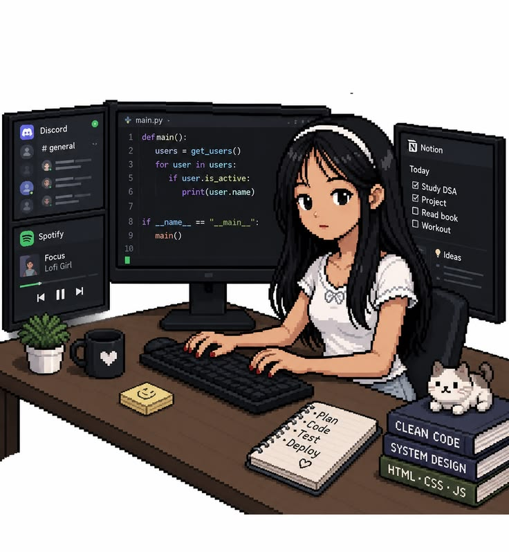

# Riya Umekar ✦ Creative Portfolio

> A warm-paper neo-brutalist scrapbook portfolio for **Riya Umekar** — AI/ML Engineer, Generative AI & RAG Specialist, and Full Stack Developer.



---

## 🌟 Key Highlights & Features

- 🎨 **Neo-Brutalist Scrapbook Design**:
  - Warm beige paper canvas (`#EDE4D3`) with dual-axis tactile graph grid lines.
  - Realistic washi tapes, scalloped postage stamps, and pinned notes with drop shadows (`4px 4px 0 #121212`).
  - Hand-drawn doodles, stars, curved arrows, and spinning stamps.

- 🤖 **Interactive AI Agent Prompt Playground (`RIYA-AI-AGENT::v2.4`)**:
  - Embedded real-time interactive terminal in the hero section.
  - Typewriter text streaming with blinking cursor for common interview / recruiter questions.
  - Instant copy response functionality.

- 🐾 **Scrapbook Stamp Reaction Pad**:
  - Interactive visitor reaction bar with live counter increments.
  - Spawns floating animated reaction particles with physics.

- ✈️ **Playful Micro-Animations & Easter Eggs**:
  - Gliding animated paper airplane with looped dashed flight trail.
  - Interactive coffee mug with animated steam waves and `+10 Energy` boost.
  - Clickable cat easter egg with purr and heart animations.
  - Infinite dual-color running marquee ribbons.

- 📁 **Interactive Project Showcase**:
  - Physical folder-tab project cards with elevation hover effects.
  - Full-featured modal view with technical breakdown, architecture metrics, and live demo / GitHub repo links.

---

## 🛠️ Tech Stack

- **Frontend Core**: React 19, JavaScript (ESNext)
- **Styling**: Vanilla CSS, Modern CSS Custom Properties, Neo-Brutalist tokens
- **Motion & Interactions**: Framer Motion, CSS Keyframe Animations
- **Icons**: Lucide React + Custom SVG Neo-Brutalist Doodles
- **Build Tool**: Vite 8

---

## 🚀 Getting Started

### Prerequisites
- Node.js (v18 or higher recommended)
- npm or yarn

### Installation
```bash
# Clone the repository
git clone https://github.com/AniruddhaAkhare/riya-portfolio.git

# Navigate to project directory
cd riya-portfolio

# Install dependencies
npm install

# Start local development server
npm run dev
```

### Production Build
```bash
npm run build
```

---

## 👤 Author

**Riya Umekar**
- 🌐 AI/ML Engineer | Generative AI & Agentic Systems
- 🎓 B.Tech in Information Technology (PRMIT&R Amravati, 2022–2026)
- 🏆 3x Hackathon Winner (Srijan'26, TechSprint'25, Innovo'25)
- 💼 [LinkedIn](https://linkedin.com/in/riyaumekar) • [GitHub](https://github.com/riya-umekar)

---

## 📄 License
MIT License © 2026 Riya Umekar
